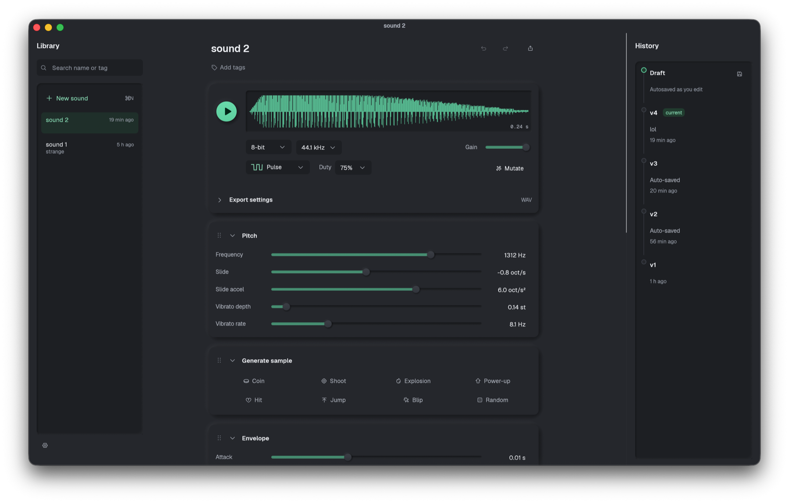

<div align="center">

# sfxc

**Game sound effects in under a minute. Every sound stays editable forever.**

A small native synthesizer for game SFX, built in Rust. Retro 8-bit and 16-bit character, a modern effect chain, and a CLI so your AI agent can make sounds too.

[Features](#features) · [Getting started](#getting-started) · [Using the app](#using-the-app) · [Agent CLI](#agent-cli) · [Roadmap](#roadmap)



</div>

## About

sfxc is in the spirit of sfxr and bfxr: click a category, get a coin, a laser or an explosion, tweak a few sliders, export. It adds what those tools leave out.

- **Sounds are never baked.** Every sound is stored as synthesis parameters with a full version history. Open one months later, change the pitch, re-export.
- **Made for you and your agent.** `sfxc-cli` works on the same library as the app, so an agent can create and export sounds straight into your game, and you fine-tune them in the GUI.
- **Authentic or modern, per sound.** Clean modern synthesis, NES-style 8-bit or 16-bit, with effects stacked in any order.
- **Reproducible.** The same patch always renders identical audio.

## Features

| | |
|---|---|
| **Modes** | 24-bit (modern), 8-bit (NES duties, LFSR noise, period quantization, 22.05 kHz 8-bit output), 16-bit (32 kHz output) |
| **Generators** | Coin, Shoot, Explosion, Power-up, Hit, Jump, Blip, Random, and **Mutate** to nudge an existing sound |
| **Sources** | Pulse, saw, triangle, sine, white and LFSR noise, 4-operator FM |
| **Shaping** | Slide, slide acceleration, vibrato, arpeggio, ADSR with punch, 6-band equalizer with presets |
| **Effects** | Bitcrusher, distortion, phaser, flanger, delay, reverb, compressor. Drag to reorder, use the same one twice |
| **Library** | Local SQLite library with search, tags, autosaved drafts and per-sound version history |
| **Export** | WAV or OGG at 22.05, 44.1 or 48 kHz, with normalization, silence trimming and optional fixed length |

## Getting started

### Install

```sh
curl -fsSL https://raw.githubusercontent.com/sarafanovn/sfxc/main/install.sh | bash
```

A small menu lets you toggle `sfxc.app` (to `~/Applications`) and `sfxc-cli` (to `~/.local/bin`). It downloads the latest release, or builds from source if there is none (needs Rust). Remove everything with `... | bash -s -- --uninstall`; your library is kept.

Or with Homebrew:

```sh
brew install --cask sarafanovn/tap/sfxc   # the app, to /Applications
brew install sarafanovn/tap/sfxc-cli      # the CLI, built from source
```

### Updates

Once a day the app checks GitHub for a newer release and shows **Update to …** in the title bar; a click installs it and restarts sfxc (through `brew upgrade` when the app came from Homebrew). `sfxc-cli update` updates the CLI (`--check` only reports; a Homebrew install is updated with `brew upgrade sfxc-cli`). Running the install command again also updates. Set `SFXC_NO_UPDATE_CHECK=1` to turn the automatic check off.

Releases are built by GitHub Actions when a `v*` tag matching the version in `Cargo.toml` is pushed; the same run bumps the cask and formula in [sarafanovn/homebrew-tap](https://github.com/sarafanovn/homebrew-tap).

### Build from source

You need a recent stable Rust toolchain (edition 2024). Packaging and testing target macOS.

```sh
git clone <repo-url> sfxc
cd sfxc
cargo run --release -p sfxc-app

# or build an unsigned macOS app bundle
./scripts/bundle.sh && open target/sfxc.app
```

The library lives in `~/Library/Application Support/sfxc/library.db`. Set `SFXC_LIBRARY=/path/to/library.db` to use another file.

## Using the app

1. Press **New sound**. It starts as a random Blip in 24-bit mode.
2. Pick a mode, then click a generator or choose a source.
3. Adjust Pitch, Envelope and Equalizer. With Auto-play on, the sound plays when you release a slider. Double-click a slider to reset it.
4. Add effects and drag them into order.
5. Save a version with `⌘S`, export with `⌘E`.

| Key | Action |
|---|---|
| `Space` | Play |
| `M` | Mutate |
| `⌘N` / `⌘D` | New sound / duplicate |
| `⌘S` / `⌘E` | Save version / export |
| `⌘Z` / `⇧⌘Z` | Undo / redo |

**Versions.** The draft autosaves continuously and is not a version. A version is created on `⌘S`, on export, and after 5 minutes of unsaved changes. Any version can be restored or duplicated as a new sound; restoring saves the current state first, so nothing is lost. Undo is per session and independent of versions.

WAV bit depth follows the mode (8, 16 or 24-bit).

## Agent CLI

`sfxc-cli` shares the library with the app, so a sound an agent creates appears in the GUI within a second. It prints JSON, never plays audio and never deletes sounds. Every change is saved as a version.

```sh
cargo install --path crates/sfxc-cli

sfxc-cli schema                                    # every parameter, range and an example patch
sfxc-cli new --name coin --category coin           # generate a sound (--mode 8bit|16bit)
sfxc-cli analyze coin                              # peak, rms, brightness, envelope (for agents that can't listen)
sfxc-cli set coin layers.0.pitch.base_freq=880 mode=Bit8
sfxc-cli fx add coin Delay
sfxc-cli export coin --to assets/sfx/coin.ogg      # remembers the path as a link
sfxc-cli export --linked                           # re-export every linked sound
```

Also available: `list`, `show`, `mutate`, `put`, `fx remove`, `rename`, `tag`, `versions`, `restore`. The full guide for agents is in [docs/cli.md](docs/cli.md).

## Project layout

```
crates/
├─ sfxc-core/    DSP and data model: patch, oscillators, equalizer, effects, render, generators, export, analysis
├─ sfxc-store/   SQLite library shared by the app and the CLI
├─ sfxc-app/     eframe/egui app: UI, cpal playback, background render worker, undo history
└─ sfxc-cli/     Command line interface for agents
```

Each edit re-renders the whole sound offline on a background thread (sounds are capped at 10 s, so this takes milliseconds) and sends the buffer to the audio output.

## Development

```sh
cargo test --workspace
cargo clippy --workspace --all-targets
```

Please run both before opening a pull request.

## Roadmap

- Use `sfxc-core` inside a game to generate sounds at runtime
- Multi-layer editing in the app (the data model already supports up to 4 layers)
- Export paths bound to a game folder from the GUI
- User presets and templates
- Keyboard / MIDI play
- Sample import
- MCP server wrapping the CLI
- Signed and notarized macOS builds

## License

[MIT](LICENSE). The bundled Geist fonts are under the SIL Open Font License, see [crates/sfxc-app/assets/fonts/OFL.txt](crates/sfxc-app/assets/fonts/OFL.txt).
